<h1 align="center">Hi 👋, I'm Кручинин Евгений</h1>
<h3 align="center">Fourth-year student of St. Petersburg State University</h3>

 
   

<h1 align="left">👨‍💻 Tech Stack</h1>

### 🤖 Robotics & Embedded

  
  
  
  

### 📱 Mobile Development

  
  
  
  

### 🛠 Tools, OS & Other

  
  
  

 

<h1 style="text-align: left;">⚡ Github Stats</h1>

  <picture>
    <source
      srcset="https://streak-stats.demolab.com/?user=LaWeite&theme=dark&hide_border=true"
      media="(prefers-color-scheme: dark)"
    />
    <source
      srcset="https://streak-stats.demolab.com/?user=LaWeite&theme=default&hide_border=true"
      media="(prefers-color-scheme: light), (prefers-color-scheme: no-preference)"
    />
    
  </picture>
  &nbsp;&nbsp;&nbsp;
  <picture>
    <source
      srcset="./stats/top-langs-dark.svg"
      media="(prefers-color-scheme: dark)"
    />
    <source
      srcset="./stats/top-langs-light.svg"
      media="(prefers-color-scheme: light), (prefers-color-scheme: no-preference)"
    />
    
  </picture>

<h2 style="text-align: left; margin-top: 20px;">📈 Activity Graph</h2>

  <picture>
    <source
      srcset="https://github-readme-activity-graph.vercel.app/graph?username=LaWeite&bg_color=0D1117&color=58A6FF&line=58A6FF&point=FFFFFF&hide_border=true"
      media="(prefers-color-scheme: dark)"
    />
    <source
      srcset="https://github-readme-activity-graph.vercel.app/graph?username=LaWeite&bg_color=ffffff&color=0e75b6&line=0e75b6&point=000000&hide_border=true"
      media="(prefers-color-scheme: light), (prefers-color-scheme: no-preference)"
    />
    
  </picture>

